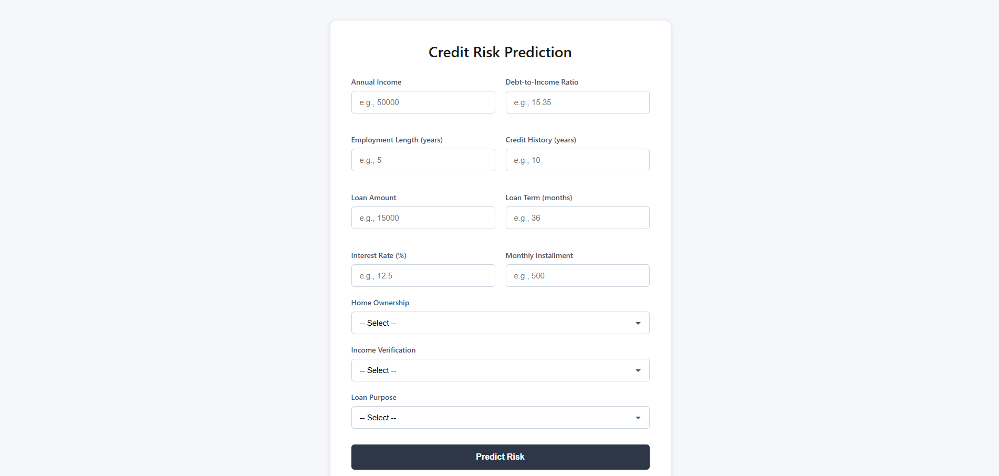

# Credit Risk Prediction System




## Overview
This project implements an end-to-end **credit risk prediction system** that estimates the probability of loan default and makes approval or rejection decisions using **cost-sensitive thresholding**.  
The emphasis is on business-aligned decision-making rather than raw accuracy.

The project covers data preprocessing, leakage prevention, model training, evaluation, and deployment using Flask.

---

## Project Structure

```
app/
├── app.py
├── credit_risk_model.pkl
├── feature_columns.pkl
└── templates/
    └── index.html
Dataset/
└── loans_full_schema.csv
notebook/
└── notebook.ipynb
├──op1.png
├──op2.png
├──requirement.txt

```


---

## Problem Statement
Loan approval decisions involve asymmetric costs:
- **False Negative (FN):** Approving a borrower who later defaults (high cost)
- **False Positive (FP):** Rejecting a borrower who would have repaid (lower cost)

This project models default risk and applies **cost-based threshold optimization** instead of using accuracy or a fixed 0.5 cutoff.

---

## Data Processing
- Removed loans with status `Current`
- Consolidated loan status into `paid` and `default`
- Prevented data leakage by dropping post-loan outcome features
- Handled missing values using median imputation and indicator variables
- Engineered `credit_history_years` from credit start date
- Dropped redundant features (`grade` in favor of `sub_grade`)

---

## Modeling
Models evaluated:
- Logistic Regression  
- L1-Regularized Logistic Regression  
- Random Forest (baseline)

**Final Model:** L1-Regularized Logistic Regression  
Selected for better ROC-AUC, generalization, and stable probability estimates.

Class imbalance handled using stratified splitting and `class_weight="balanced"`.

---

## Evaluation Strategy
- **ROC-AUC** used for model selection
- Accuracy avoided due to class imbalance and asymmetric business costs

---

## Cost-Sensitive Thresholding
Instead of a default threshold, the decision threshold is optimized using:

**Total Cost = (False Negatives × Cost_FN) + (False Positives × Cost_FP)**


Assumptions:
- Cost_FN = 3  
- Cost_FP = 1  

The threshold minimizing total cost is used for final predictions.

---

## Deployment
A Flask web application:
- Accepts key loan application inputs from the user
- Fills internal or bureau-style features with realistic defaults
- Outputs the probability of default and a final decision (APPROVE / REJECT)

The deployed model includes preprocessing and inference in a single pipeline.

---

## How to Run

pip install -r requirement.txt
cd app
python app.py


Open `http://127.0.0.1:5000` in a browser.

---

## Key Takeaways
- Credit risk modeling prioritizes decision quality over accuracy
- Probabilities must be converted into actions using business costs
- Preventing data leakage is essential in financial ML systems

---

## Limitations
- Cost assumptions are illustrative
- Default feature values are static
- No production monitoring or retraining pipeline implemented
